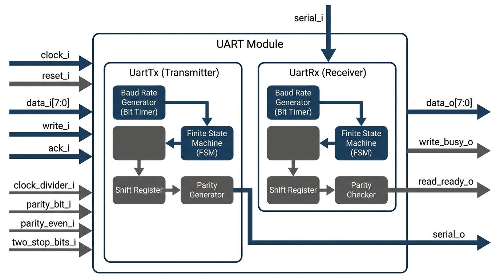

# Parametric UART Transceiver IP Core with Self-Checking Testbenches

A synthesizable, fully parameterized **UART (Universal Asynchronous Receiver-Transmitter)** IP core designed in Verilog. This core features dynamic runtime configuration, robust hardware handshaking, mid-bit sampling for noise cancellation, and is validated by a rigorous self-checking verification suite.

---

## Hardware Architecture

The IP consists of two independent, highly optimized FSM-driven blocks:
*   **`UartTx` (Transmitter Engine):** Operates on a 3-state FSM (`POST_RESET`, `IDLE`, `SEND_PACKET`) [1]. It features an edge-triggered write-oneshot detector [2] and an integrated parity generator [2, 3].
*   **`UartRx` (Receiver Engine):** Operates on a 3-state FSM (`IDLE`, `RECEIVE`, `VALIDATE`) [4]. It utilizes a mid-bit sampling mechanism (`clock_divider_i / 2`) [5] for noise rejection and validates start, parity, and stop bits [6].

---

## Key Features

*   **Parametric Baud Rate:** Parameterized clock divider bit-width (`CLOCK_DIVIDER_WIDTH`) [7, 8] optimizes resource utilization depending on target system clocks.
*   **Dynamic Runtime Frame Configuration:** 
    *   **Stop Bits:** Run-time selectable 1 or 2 stop bits (`two_stop_bits_i`) [9].
    *   **Parity:** Run-time configurable parity (`parity_bit_i`, `parity_even_i`) supporting Even, Odd, or No Parity [9].
*   **Robust Hardware Handshaking:** Prevent data loss and overwrites using edge-triggered `write_i`/`write_busy_o` (TX) and `ack_i`/`read_ready_o` (RX) flow-control ports [10].
*   **Noise Glitch Rejection:** Confirms start-bit validity at the mid-bit sample point [5, 11] to abort false transactions.

---

## Interface Signal Port Map

### System & Control Registers
*   `clock_i` / `reset_i`: Core system clock and active-high synchronous reset [7, 12].
*   `clock_divider_i` `[CLOCK_DIVIDER_WIDTH-1:0]`: Defines baud rate timing [7].

### Configuration Inputs
*   `two_stop_bits_i`: Transmits 2 stop bits if High, 1 if Low [9].
*   `parity_bit_i`: Enables parity check if High [9].
*   `parity_even_i`: Even parity if High, Odd parity if Low [9].

### Physical SerDes & Bus Interface
*   `serial_i` / `serial_o`: UART RX/TX physical lines [10].
*   `data_i` `[7:0]` / `data_o` `[7:0]`: 8-bit parallel TX/RX data buses [10].
*   `write_i` / `write_busy_o`: Edge-triggered write strobe and busy indicator [10].
*   `read_ready_o` / `ack_i`: Receive data-ready flag and acknowledgement strobe [10].

---

## Verification Suite

The repository contains **15 independent, self-checking testbenches** that execute targeted corner cases to guarantee IP integrity:

| Testbench Category | Target Verifications | Key Test Files |
| :--- | :--- | :--- |
| **Baud Rate & Timing** | Validates data correctness under 1x, 2x, 4x, and 8x clock ratios | `uart_tx_write_1x_test.v` [13], `uart_rx_read_2x_test.v` [14], `uart_rx_read_8x_test.v` [15] |
| **Error & Noise Mitigation** | Aborts receipt upon finding invalid start-bits (noise/glitch) | `uart_rx_invalid_start_bit_test.v` [11] |
| **Handshake & Flow Control** | Verifies oneshot triggers and prevents data overwrite under consecutive writes | `uart_tx_overwrite_test.v` [16], `uart_tx_write_oneshot_test.v` [17], `uart_rx_overwrite_test.v` [18] |
| **Frame Formatting** | Verifies Parity generation/detection and Stop-bit configuration | `uart_tx_parity_test.v` [19], `uart_tx_stop_bit_test.v` [20], `uart_rx_parity_test.v` [21] |
| **Reset & Recovery** | Ensures FSMs properly align and block writes during and immediately after a reset event | `uart_tx_reset_test.v` [22], `uart_tx_write_reset_test.v` [23] |

All simulations are written in pure synthesizable-friendly Verilog tasks, outputting clear standard-out failures if any protocol timing is breached.
